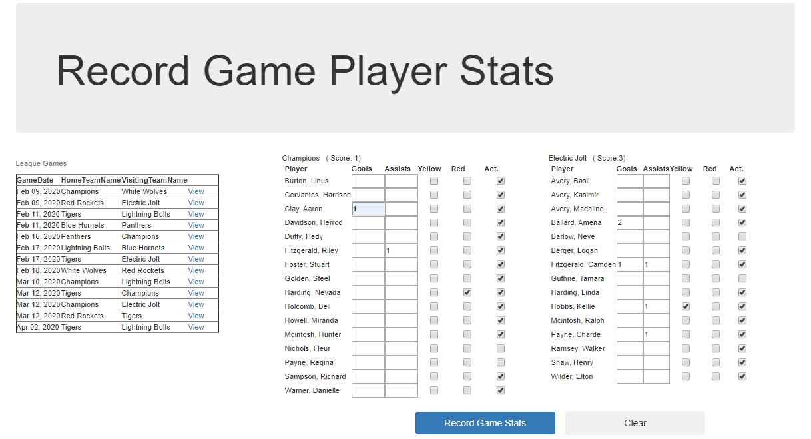
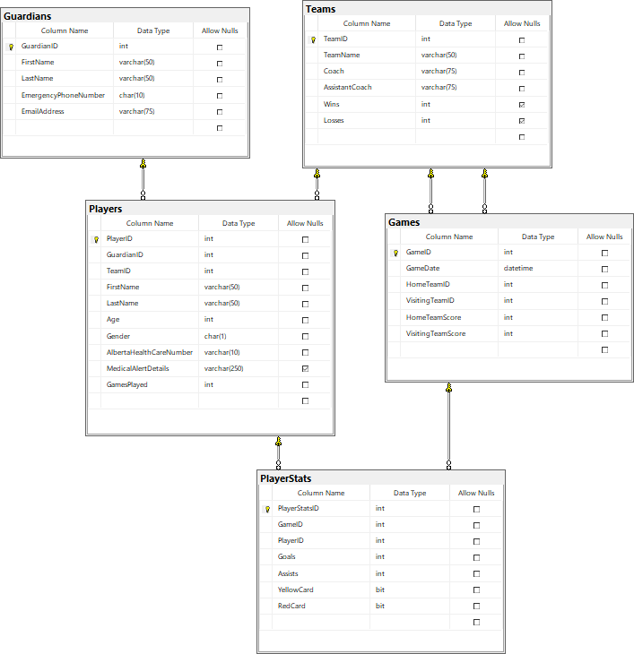

# In-Class Assessment - FSIS OLTP - 

> Data Collection and Transaction Processing -
> **Read the entire instructions before beginning your work**

Student Name: **YOUR_NAME**

> Place your name  in the line above. Work on the lab computer, not your laptop or personal computer.

## Marking Summary

| Evaluation Item                                                                                            | Weight | **Mark** | Comment |
|------------------------------------------------------------------------------------------------------------|:------:|:--------:|:-----:|
| Errors - collect all possible errors with appropriate messages (excluding ArgumentNullExceptions)                                                |   2    | **TBD**  |   |
| Validate - values exist for incoming data                                                        |   1    | **TBD**  |   |
| Validate - game record should already exists on the database                  |   1    | **TBD**  |   |
| Validate - no player stats for game already exists                  |   1    | **TBD**  |   |
| Validate - player exists             |   1    | **TBD**  |   |
| Validate - player stats goals and/or assists cannot be negative             |   2    | **TBD**  |   |
| Validate - player stat team's goals equals Game team's score                                           |   2    | **TBD**  |   |
| Processing - create player stats                                                                       |   3    | **TBD**  |   |
| Processing - update player record                                                                      |   2    | **TBD**  |   |
| **Penalty** - Processing **NOT** done within a single transaction            |   -4   | **TBD**  |   
| Total                                                                                                      |  *15*  | **TBD**  |

### Marking Rubric

| Weight | Breakdown |
| ----- | --------- |
| **1** | 1 = Proficient (requirement is met) 0 = Incomplete (requirement not met, missing large portions) |
| **2** | 2 = Proficient (requirement is met) 1 = Limited (requirement is poorly met, minor errors) 0 = Incomplete (requirement not met, missing large portions) |
| **3** | 3 = Proficient (requirement is met) 2 = Capable (requirement is adequately met, minor errors) 1 = Limited (requirement is poorly met, major errors) 0 = Incomplete (requirement not met, missing large portions) |
| **4** | 4 = **Proficient** (requirement is met) 3 = **Capable** (requirement is adequately met, minor errors) 2 = **Acceptable** (requirement is partially met, minor errors) 1 = **Limited** (requirement is poorly met, major errors) 0 = **Incomplete** (requirement not met, missing large portions) |

----

## Database

The physical database can be installed from the `.bacpac` file included in the starter kit.

## About FSIS

> **Fort Sasquatch Indoor Soccer** is a community soccer league.

## Requirements

In this assessment, you will be demonstrating your understanding of CQRS using EntityFramework. In this assessment, you will be evaluated on the following:

- creating a testing environment in Linqpad.
- Implement a method processing multiple records within a Transaction.
- Implement logical validation within the transactional method.

The repository contains the database in a `.bacpac` file called **FSIS_2018.bacpac**. The starting Linqpad file has certain portions of the assessment pre-coded. **This code works and should not be altered.**

You are to complete each of the activities to create a successful solution to this assessment. You will need to use specified names in portions of the activities to integrate with the existing code. You many need to create local variables to use in your answer (these variables can be called whatever you wish). Use the following activity instructions to complete this assessment.

### Use Regular Commits

 Ensure you sync your local clone to the classroom on GitHub before the end of class. The classroom access ends at
the end of class. **It is your responsibility that your work is properly submitted. Failure to submit your work will result is a mark of 0 (zero).**

### Setup

Restore the supplied SQL database by importing it as a Data-Tier Application. The database name is **FSIS_2018**. The database contains data for testing your solution. **You will have to create the EF connection string to use your sql server.** Run the solution. 

### Driver

The Main driver has been coded for you. Test scenarios have been setup for you to use. The scenarios are commented out. To use a scenario, uncomment the call to the service method. Run and view the results. Re-apply the comment after testing. Move on to the next test scenario.

A query has been created that will allow you to view the before and after results.

The amount of test data has been reduced so you can quickly view any changes to the data.

## **Altering any of the given code may and probably will corrupt the driver. DO NOT alter the given code unless instructed.**

### Web Form Event Actions

Collects the the goals, assists, yellow and/or red cards for each player whether the player actually played or not. A player has played in the game if the **Act** (active) checkbox is checked. Collection of the player data used the supplied ViewModel **PlayerGameStat**. Collects each team set of players in a **separate** `List<T>`.

Pass the game id (from games list) and the **2 separate** `List<PlayerGameStat>` lists to the service transaction method **PlayerStatController.RecordGamePlayerStats(…)** for processing. 

----

### Activity 1 - Transactional service method: `PlayerStatController.RecordGamePlayerStats(int, List<PlayerGameStat>, List<PlayerGameStat>)`

The service method must insert new player game stats and update player participation.

- Validations
  - parameter values must exist (ArgumentNullException).
  - The **Games** record for the incoming stats **should already** be on the database (ArgumentException).
  - player stats for the game must not already be on file,  
  - goals and assists are non-negative integer values,  
  - total number of goals by players on a team is equal to the team score recorded for the game. 

- Processing
  - create **a single** `PlayerStat` record **only** for a player that has a goal, an assist, a yellow card and/or a red card (referred to as a game stat) in this game 
  - update each player's record (field: `GamesPlayed`) if they **participated** (played) in the game **independent** of having any stats.

**Do not** create any player stat records or update player participation if there are **any** validation errors. Process this request within a single transaction.

